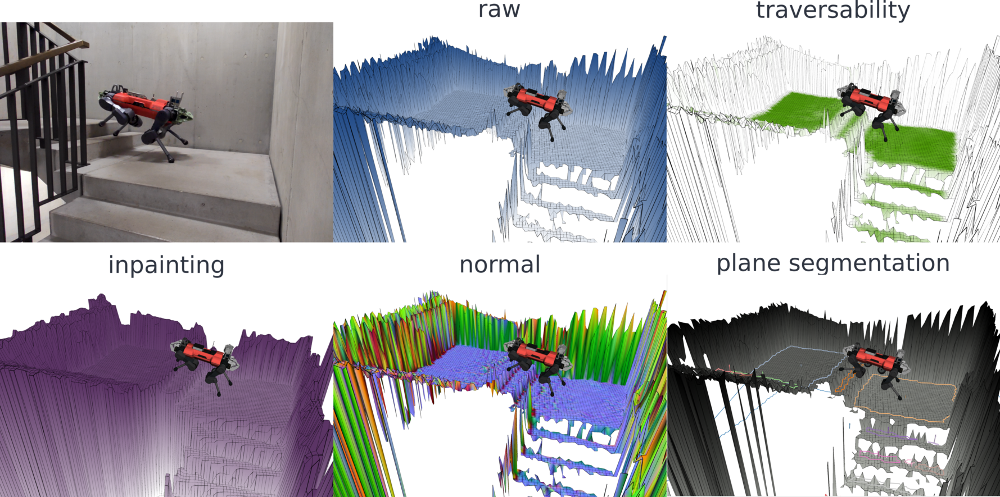
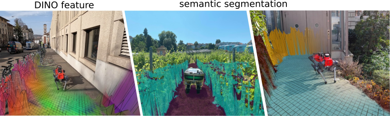
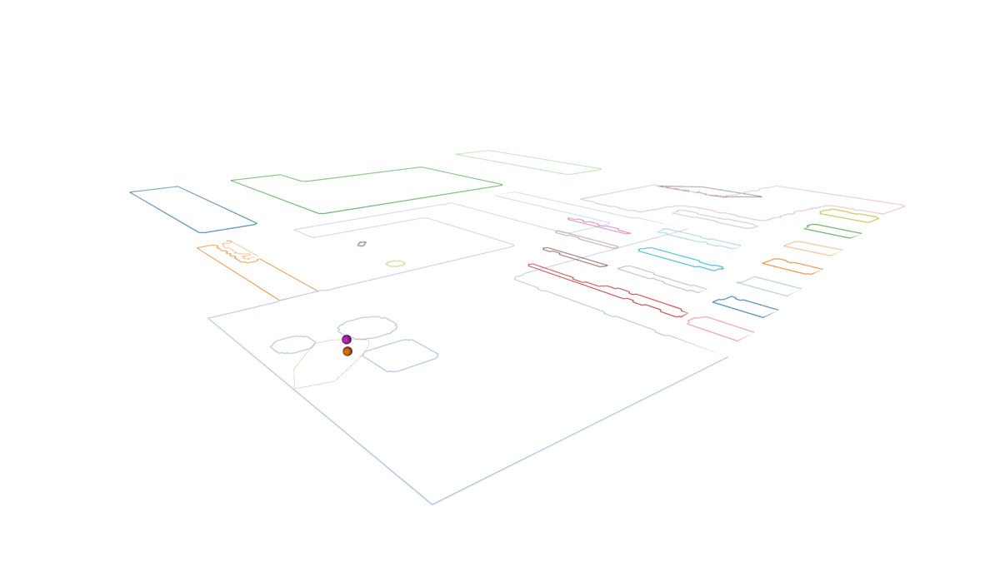
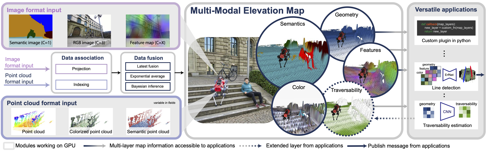
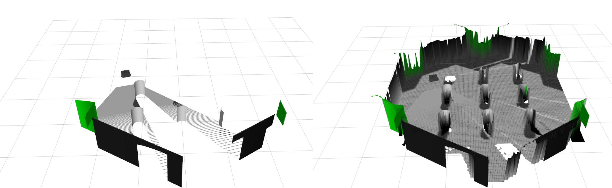

# ROS2 Elevation Mapping Cupy 
 


[Documentation](https://leggedrobotics.github.io/elevation_mapping_cupy/)

## Overview

The Elevaton Mapping CuPy software package represents an advancement in robotic navigation and locomotion.
Integrating with the Robot Operating System (ROS) and utilizing GPU acceleration, this framework enhances point cloud registration and ray casting,
crucial for efficient and accurate robotic movement, particularly in legged robots.




## Key Features

- **Height Drift Compensation**: Tackles state estimation drifts that can create mapping artifacts, ensuring more accurate terrain representation.

- **Visibility Cleanup and Artifact Removal**: Raycasting methods and an exclusion zone feature are designed to remove virtual artifacts and correctly interpret overhanging obstacles, preventing misidentification as walls.

- **Learning-based Traversability Filter**: Assesses terrain traversability using local geometry, improving path planning and navigation.

- **Versatile Locomotion Tools**: Incorporates smoothing filters and plane segmentation, optimizing movement across various terrains.

- **Multi-Modal Elevation Map (MEM) Framework**: Allows seamless integration of diverse data like geometry, semantics, and RGB information, enhancing multi-modal robotic perception.

- **GPU-Enhanced Efficiency**: Facilitates rapid processing of large data structures, crucial for real-time applications.

## Map Editing & Persistence Services (ROS 2)

- `/elevation_mapping_cupy/masked_replace` (`grid_map_msgs/srv/SetGridMap`): Patch specific regions of the live CuPy map. Provide one or more layers plus an optional `mask` layer; cells with non-NaN mask values are overwritten, NaNs are ignored.
- `/elevation_mapping_cupy/save_map` (`grid_map_msgs/srv/ProcessFile`): Persist the current state to `<file_path>` (published layers) and `<file_path>_raw` (all internal layers) rosbag2 files. Bags are written with the configurable `save_map_storage_id` (defaults to `mcap`).
- `/elevation_mapping_cupy/load_map` (`grid_map_msgs/srv/ProcessFile`): Restore a previously saved map by pointing at the fused bag path; the node reloads both fused/raw data, refreshes caches, and republishes immediately.

Example usage:

```bash
ros2 service call /elevation_mapping_cupy/masked_replace grid_map_msgs/srv/SetGridMap "{map: ...}"
ros2 service call /elevation_mapping_cupy/save_map grid_map_msgs/srv/ProcessFile "{file_path: '/tmp/em_map', topic_name: ''}"
ros2 service call /elevation_mapping_cupy/load_map grid_map_msgs/srv/ProcessFile "{file_path: '/tmp/em_map', topic_name: ''}"
```

Parameters such as `masked_replace_service_mask_layer_name`, `save_map_default_topic`, `save_map_storage_id`, and `service_namespace` can be set via the usual ROS 2 parameter mechanisms to adapt the services to different deployments.

## Overview



Overview of our multi-modal elevation map structure. The framework takes multi-modal images (purple) and multi-modal (blue) point clouds as
input. This data is input into the elevation map by first associating the data to the cells and then fused with different fusion algorithms into the various
layers of the map. Finally the map can be post-processed with various custom plugins to generate new layers (e.g. traversability) or process layer for
external components (e.g. line detection).

## Citing

If you use the Elevation Mapping CuPy, please cite the following paper:
Elevation Mapping for Locomotion and Navigation using GPU

[Elevation Mapping for Locomotion and Navigation using GPU](https://arxiv.org/abs/2204.12876)

Takahiro Miki, Lorenz Wellhausen, Ruben Grandia, Fabian Jenelten, Timon Homberger, Marco Hutter  

```bibtex
@inproceedings{miki2022elevation,
  title={Elevation mapping for locomotion and navigation using gpu},
  author={Miki, Takahiro and Wellhausen, Lorenz and Grandia, Ruben and Jenelten, Fabian and Homberger, Timon and Hutter, Marco},
  booktitle={2022 IEEE/RSJ International Conference on Intelligent Robots and Systems (IROS)},
  pages={2273--2280},
  year={2022},
  organization={IEEE}
}
```

If you use the Multi-modal Elevation Mapping for color or semantic layers, please cite the following paper:

[MEM: Multi-Modal Elevation Mapping for Robotics and Learning](https://arxiv.org/abs/2309.16818v1)

Gian Erni, Jonas Frey, Takahiro Miki, Matias Mattamala, Marco Hutter

```bibtex
@inproceedings{erni2023mem,
  title={MEM: Multi-Modal Elevation Mapping for Robotics and Learning},
  author={Erni, Gian and Frey, Jonas and Miki, Takahiro and Mattamala, Matias and Hutter, Marco},
  booktitle={2023 IEEE/RSJ International Conference on Intelligent Robots and Systems (IROS)},
  pages={11011--11018},
  year={2023},
  organization={IEEE}
}
```

## Quick instructions to run

### Installation

First, clone to your catkin_ws

```zsh
mkdir -p catkin_ws/src
cd catkin_ws/src
git clone https://github.com/leggedrobotics/elevation_mapping_cupy.git
```

Then install dependencies.
You can also use docker which already install all dependencies.
When you run the script it should pull the image.

```zsh
cd docker
./run.sh
```

You can also build locally by running `build.sh`, but in this case change `IMAGE_NAME` in `run.sh` to `elevation_mapping_cupy:latest`.

For more information, check [Document](https://leggedrobotics.github.io/elevation_mapping_cupy/getting_started/installation.html)

### Build package

Inside docker container.

```zsh
cd $HOME/catkin_ws
catkin build elevation_mapping_cupy

> [!NOTE]
> The ``plane_segmentation`` and ``sensor_processing`` stacks were removed from this workspace because they are not maintained on ROS 2.  Use an older commit if you still need them.
```

### Run turtlebot example



```bash
export TURTLEBOT3_MODEL=waffle
roslaunch elevation_mapping_cupy turtlesim_simple_example.launch
```

To control the robot with a keyboard, a new terminal window needs to be opened.
Then run

```bash
export TURTLEBOT3_MODEL=waffle
roslaunch turtlebot3_teleop turtlebot3_teleop_key.launch
```

Velocity inputs can be sent to the robot by pressing the keys `a`, `w`, `d`, `x`. To stop the robot completely, press `s`.
